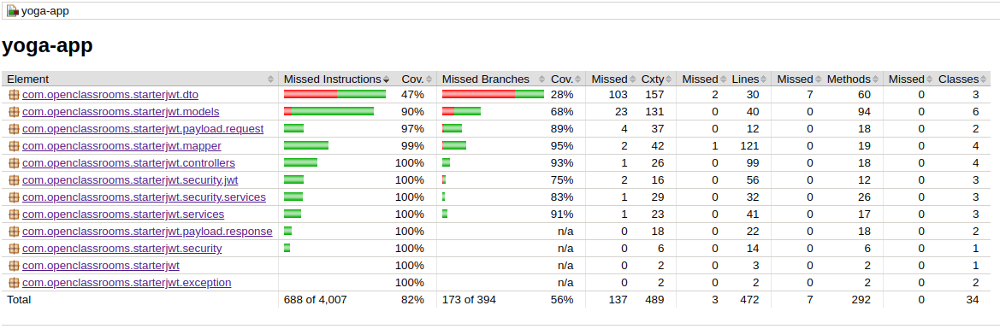
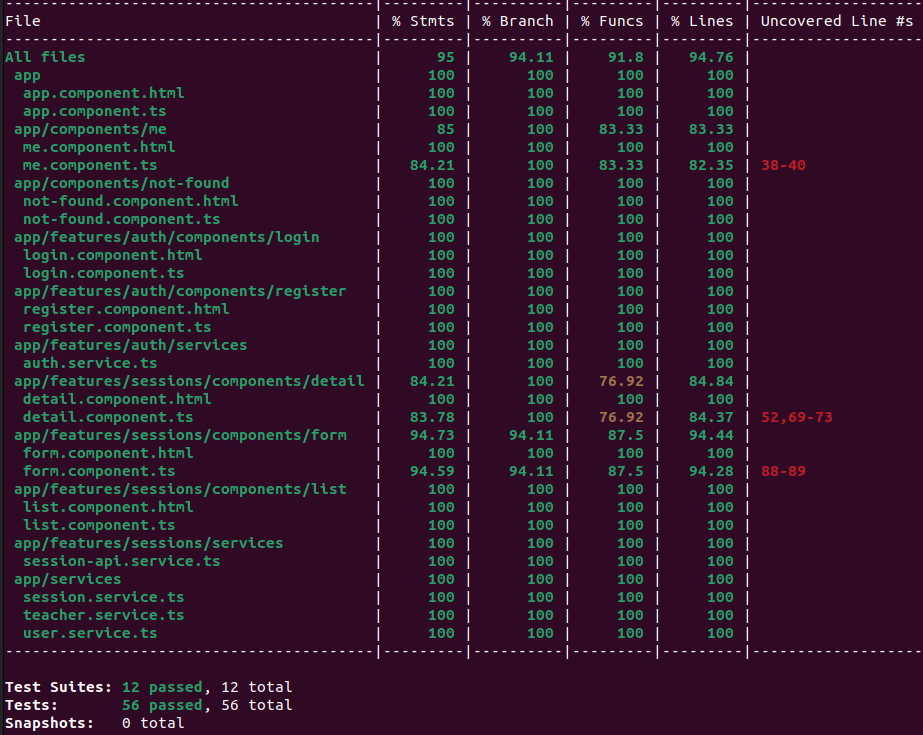
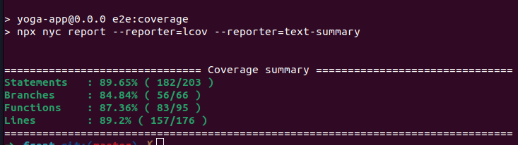
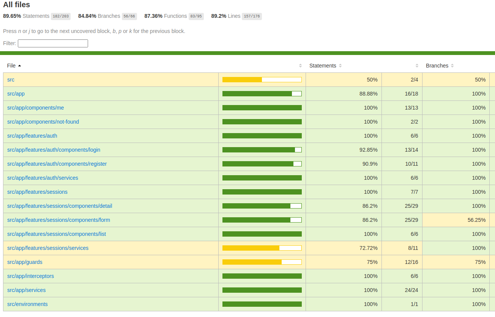

# Lancement de l'application
## Back


1 - Installer Java 11

2 - Installer mysql et créer un user et une base de donnée nommée `test`

3 - Cloner le répo git sur votre local `git clone git@github.com:HidTosh/Testez-une-application-full-stack.git`

4 - Mettre à jour le fichier (application.properties), ajouter l'utlisateur et le mot de passe de la base de données

```
spring.datasource.username=<provide your user name db>
spring.datasource.password=<provide your user password db>
```

5 - importer la base de données

> mysql -u <user-name-db> -p test < /PATH TO REPO/ressources/sql/script.sql

6 - lancer le projet :

> mvn dependency:tree # get dependency 
>
> mvn spring-boot:run # start project

7 - Vérifier que le projet est bien  lancé sur le port 8080

## Front

1 - Installer NodeJS 16

2 - Se rendre dans le dossier front `cd front`

3 - Installer des dépendances : `npm install`

4 - Lancer le projet `npm run start`

5 - Ouvrir l'URL http://localhost:4200

6 - Se connecter avec 
```
- login: yoga@studio.com
- password: test!1234
```

# Lancement des tests : 

## Back

- Lancement des tests unitaire et d'intégration : 

> mvn test

- Générer le rapport de coverage code back

> mvn clean package

- Ouvrire le rapport de coverage stocké dans le dossier :

`
  back/target/site/jacoco/index.html
`




## Front

- Lancement des tests unitaire et d'intégration

> npm run test

- Générer le rapport de coverage code front

> npm test -- --coverage
> 
Le rapport de coverage s'affiche directement dans le terminal




## Test E2E

- Lancement des test e2e:

> npm run e2e

Générer le rapport de coverage après le lancement des tests e2e

> npm run e2e:coverage

Le Rapport est disponible dans le terminal, sinon vous pouvez ouvrir dans le browser:

> front/coverage/lcov-report/index.html





